# Circuit

[](LICENSE.md)
[](https://github.com/devletes/filament-circuit/stargazers)

A node-based canvas for Filament — drag, connect and configure nodes natively in Livewire and Alpine. What React Flow is for React, without the React.

Circuit is a **form field**. It binds to a JSON column, renders a canvas, and saves `{ nodes, edges, viewport }`. It knows nothing about what your nodes mean.

- `CircuitCanvas` for forms, `CircuitEntry` for infolists and View pages — same options, same styling
- Node types declared inline or as classes, auto-discovered from a folder
- Node config edited in a real Filament modal or slide-over, from your own `schema()`
- Node cards draw a summary line or a full infolist body
- Per-node actions, exactly like a table's `recordActions()`
- Outcomes and opaque conditions on connections, with label pills
- Topology validated at save time *and* live, attributed to the offending node
- Undo/redo, tidy-up, minimap, zoom, resize, flip direction — each one switchable
- Plain DOM styled with Filament's palette variables, so dark mode and panel themes already work

<table><tr>
<td width="50%"></td>
<td width="50%">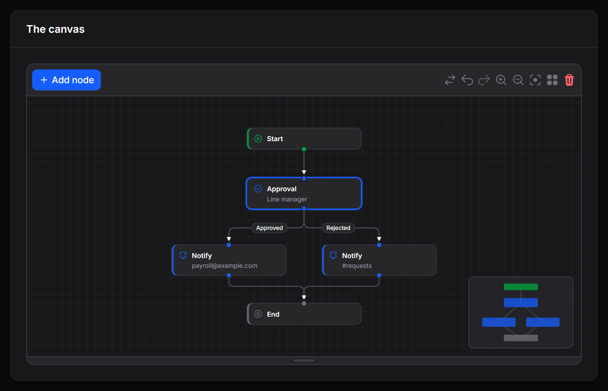</td>
</tr></table>

## Why not React Flow

React Flow is excellent, and if you already run React it is the right answer. Inside a Livewire panel it costs you a second component model and a second styling system: every custom node is JSX, so Filament's visual language has to be re-implemented and kept in sync by hand.

Circuit's nodes are plain DOM styled with Filament's own palette variables, so a panel theme change carries through for free, and dark mode already works.

## Requirements

- PHP `^8.2`
- Filament `^4.0|^5.0`

## Installation

Not on Packagist yet, so point Composer at the repository:

```bash
composer config repositories.circuit vcs https://github.com/devletes/filament-circuit.git
composer require devletes/filament-circuit
```

Assets register themselves through `FilamentAsset`; there is no build step and nothing to add to your custom theme.

## Quick start

```php
use Devletes\Circuit\Forms\Components\CircuitCanvas;
use Devletes\Circuit\Support\NodeType;

CircuitCanvas::make('graph')
    ->height(560)
    ->nodeTypes([
        NodeType::make('start')
            ->label('Start')
            ->icon('heroicon-o-play-circle')
            ->color('success')
            ->initial()
            ->singleton(),

        NodeType::make('approval')
            ->label('Approval')
            ->icon('heroicon-o-check-badge')
            ->color('primary')
            ->description('Route to an approver')
            ->outcomes(['approved' => 'Approved', 'rejected' => 'Rejected'])
            ->schema([
                Select::make('approver')->options([...])->required(),
            ])
            ->summariseUsing(fn (array $config): ?string => $config['approver'] ?? null),

        NodeType::make('end')
            ->label('End')
            ->icon('heroicon-o-stop-circle')
            ->terminal(),
    ])
```

Cast the column to `array` and you are done:

```php
protected $casts = ['graph' => 'array'];
```

## Node types

A node type is pure presentation plus topology rules. The palette offers one entry per addable type, with its icon, label and description.

<table><tr>
<td width="50%">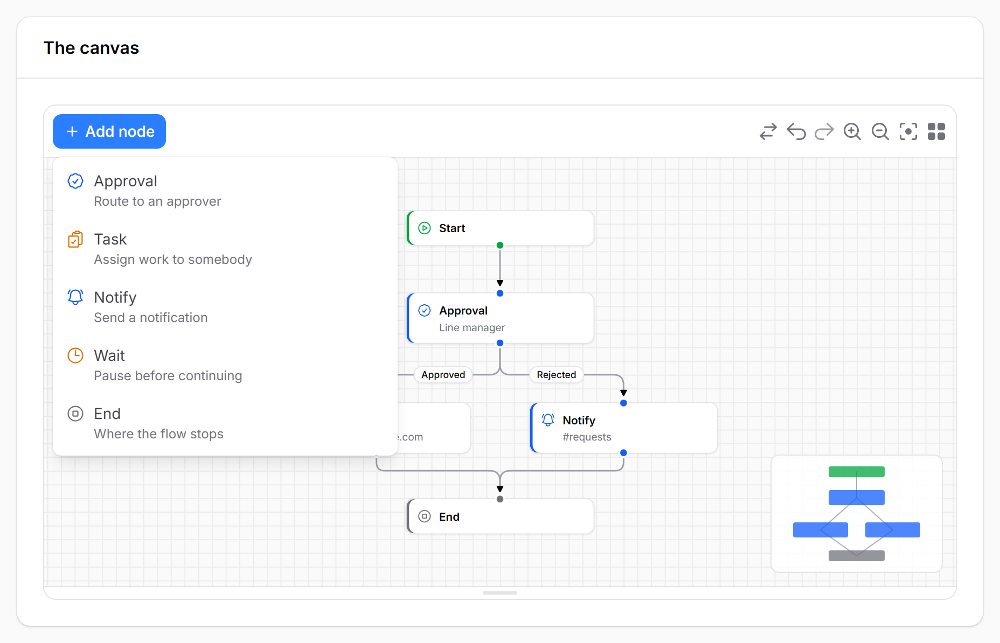</td>
<td width="50%">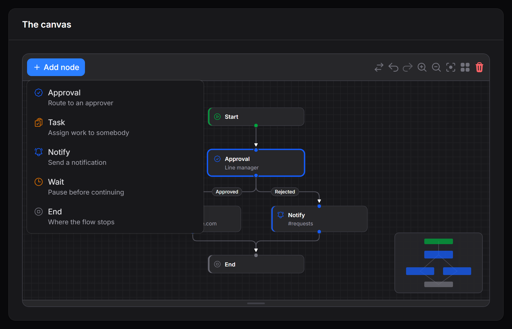</td>
</tr></table>

| Method | Effect |
|---|---|
| `label()` / `icon()` / `color()` / `description()` | Presentation. `color()` takes any Filament colour name |
| `initial()` | Entry point — accepts no incoming edges |
| `terminal()` | Exit point — emits no outgoing edges |
| `singleton()` | At most one per graph |
| `addable(false)` | Withhold from the palette while keeping the type registered — stored graphs still render, validate and execute |
| `maxOutgoing()` / `maxIncoming()` | Edge limits, enforced live while connecting |
| `outcomes()` | Ordered map of `outcome key => label` — the distinct ways this node can conclude |
| `schema()` | Filament components for editing this node's `config`. Accepts a closure for lazy options |
| `summariseUsing()` | One-line summary rendered on the node body |
| `infolist()` | Infolist components rendered on the node body, for types that need more than one line |
| `validateConfigUsing()` | App-level save-time rules — "a role approver needs a role" |

### Class-based node types

Beyond a couple of nodes, inline chains get unwieldy. Define each type as a class instead — one file owning presentation, topology, schema, summary and config rules:

```php
use Devletes\Circuit\Support\NodeDefinition;

class ApprovalNode extends NodeDefinition
{
    public function icon(): ?string { return 'heroicon-o-check-badge'; }

    public function color(): string { return 'primary'; }

    public function sort(): int { return 10; }

    public function outcomes(): array
    {
        return ['approved' => 'Approved', 'rejected' => 'Rejected'];
    }

    public function schema(): array
    {
        return [Select::make('approver')->options([...])->required()];
    }

    public function summarise(array $config): ?string
    {
        return $config['approver'] ?? null;
    }

    public function validateConfig(array $config): array
    {
        return blank($config['approver'] ?? null) ? ['An approver must be selected.'] : [];
    }
}
```

The type name derives from the class basename (`ApprovalNode` → `approval`, `FieldUpdateNode` → `field_update`); override `type()` to change it. `sort()` orders the palette. Every `NodeType` option has a matching overridable (`isInitial()`, `isAddable()`, `maxOutgoing()`, …).

A `NodeRegistry` collects definitions — usually by auto-discovering a folder — and feeds both the canvas and whatever reads the saved graph:

```php
$this->app->singleton(NodeRegistry::class, fn (): NodeRegistry => NodeRegistry::make()
    ->discoverIn(app_path('Workflows/Nodes'), 'App\\Workflows\\Nodes'));

CircuitCanvas::make('graph')->nodeTypes(app(NodeRegistry::class));
```

Dropping a new definition into the folder is all it takes. `nodeTypes()` accepts any mix: inline `NodeType` chains, `NodeDefinition` instances or class-strings, or a whole registry.

### Node bodies

`summariseUsing()` gets you one line. When a type's configuration says more than that, `infolist()` renders real Filament entries inside the node card:

```php
NodeType::make('task')
    ->schema(fn (): array => [
        TextInput::make('title')->required(),
        TextInput::make('assignee'),
        Toggle::make('blocking'),
    ])
    ->infolist(fn (): array => [
        TextEntry::make('title')->hiddenLabel()->placeholder('Untitled task'),
        TextEntry::make('assignee')->label('Assignee')->placeholder('Unassigned'),
        IconEntry::make('blocking')->label('Blocking')->boolean(),
    ]);
```

Entry names resolve against the node's own `config`, the way a `RepeatableEntry` row reads its array — `TextEntry::make('assignee')` shows `config.assignee`. The closure also receives `$config` and `$node`.

<table><tr>
<td width="50%">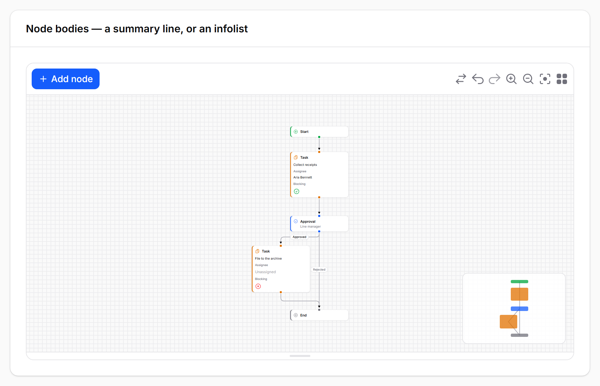</td>
<td width="50%">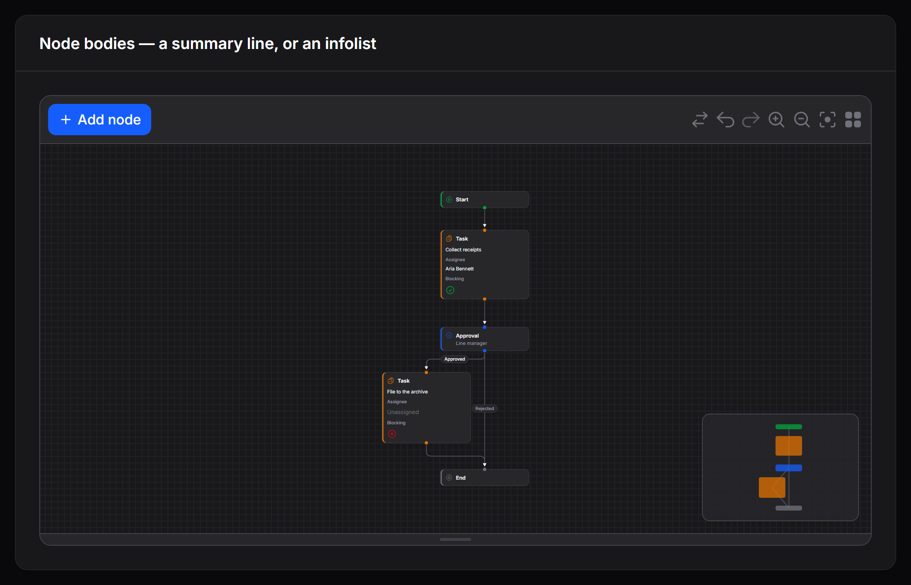</td>
</tr></table>

Three things worth knowing:

- **It replaces the summary line**, so a type that declares both shows only the infolist. Keep `summariseUsing()` anyway: the summary is what the graph *stores*, and what a node announces to a screen reader.
- **It renders from live config, not a snapshot.** The summary is computed once at save time and written onto the node; an infolist is re-rendered every time the canvas hears back from the server.
- **Clicks pass through to the card.** The node is a drag surface, so keep the body read-only and put anything clickable in `nodeActions()`.

Cards are 220px wide, so entries are scaled down to node chrome and long values wrap. Tidy-up stacks levels by measured height, so a taller body pushes the next level down rather than being landed on.

## Editing node config

Double-clicking a node (or pressing <kbd>Enter</kbd> on it) mounts a built-in Filament action rendering that node type's `schema()`, pre-filled from the node's `config`. On submit, Circuit writes the config back, recomputes `summariseUsing()`, and tells the canvas to re-read state. No wiring needed.

<table><tr>
<td width="50%">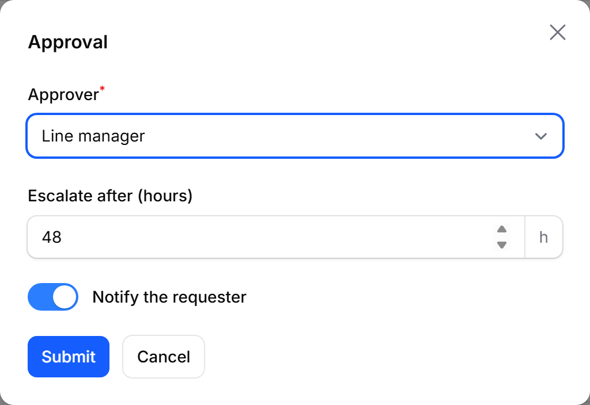</td>
<td width="50%">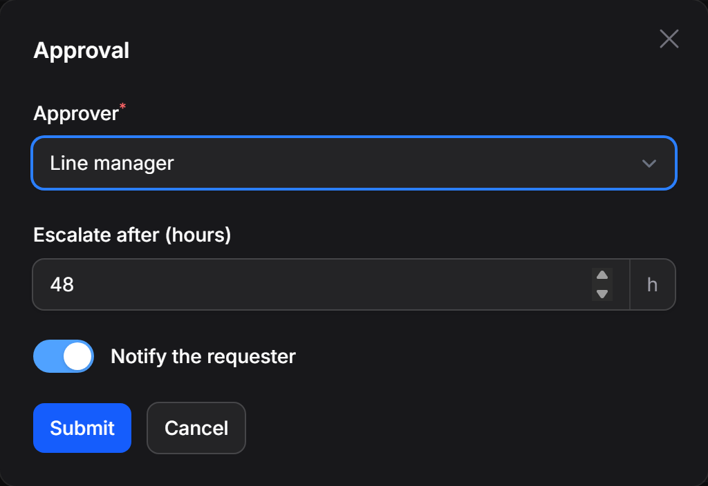</td>
</tr></table>

Prefer a slide-over? Opt in per canvas — the same switch exists for edge config:

```php
CircuitCanvas::make('graph')
    ->nodeConfigInSlideOver()
    ->edgeConfigInSlideOver()
    ->nodeConfigModalWidth(Width::TwoExtraLarge)
    ->edgeConfigModalWidth('lg')
```

<table><tr>
<td width="50%">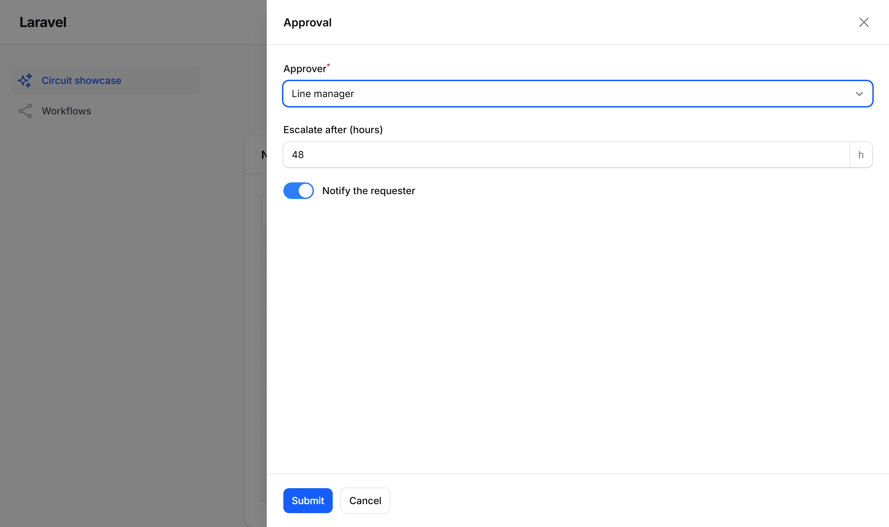</td>
<td width="50%">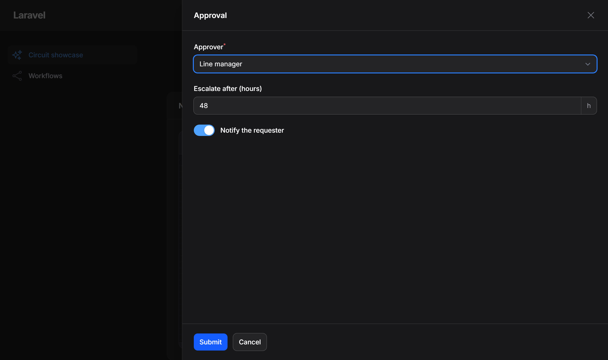</td>
</tr></table>

Outside a Filament schema (a bare Alpine mount), the canvas falls back to browser events: `circuit-node-edit` fires with `{ id, type, config }`, and you write back with `$dispatch('circuit-update-node', { id, config })`. `circuit-node-selected` fires on every selection change in both modes.

### Adding your own sections to the node modal

A node type's `schema()` covers its own config. Context *about* the node — where it goes next, what depends on it — belongs to the app. `nodeSchemaSuffix()` appends components after the type's own fields:

```php
CircuitCanvas::make('graph')
    ->nodeSchemaSuffix(fn (array $node, array $outgoing): array => count($outgoing) > 1
        ? [Section::make('Outgoing connections')->schema([...])]
        : [])
```

The closure receives `$node` (the full array), `$nodeId`, `$nodeType`, and `$outgoing` / `$incoming` — take whichever you need, by name. `getOutgoingEdges()` / `getIncomingEdges()` are public on the canvas too.

The components are state-pathed under `_circuit` and that whole branch is discarded on submit, so a suffix is **display-only whatever it renders** — it can never write to the node's `config`.

## Node actions

`nodeActions()` renders your own actions **on the node card**: a flat list of `Filament\Actions\Action` and `Filament\Actions\ActionGroup`, exactly as a table takes `recordActions()`.

```php
use Devletes\Circuit\Actions\NodeAction;
use Filament\Actions\ActionGroup;

CircuitCanvas::make('graph')
    ->nodeActions([
        // Inline: rendered as an icon-only button.
        CircuitCanvas::configureNodeAction(),

        // Grouped: one trigger (ellipsis by default) opening a dropdown.
        ActionGroup::make([
            NodeAction::make('duplicate')
                ->label('Duplicate node')
                ->icon('heroicon-m-document-duplicate')
                ->action(fn (array $node) => /* … */),

            CircuitCanvas::deleteNodeAction()
                ->hidden(fn (?array $node): bool => $node['type'] === 'start'),
        ]),
    ])
```

Buttons appear on **hover**, on **focus** (so they can be tabbed to), and while the node is **selected**. They live inside the transformed layer, so they scale with zoom; clicking one never starts a drag, opens node config, or changes the selection.

<table><tr>
<td width="50%">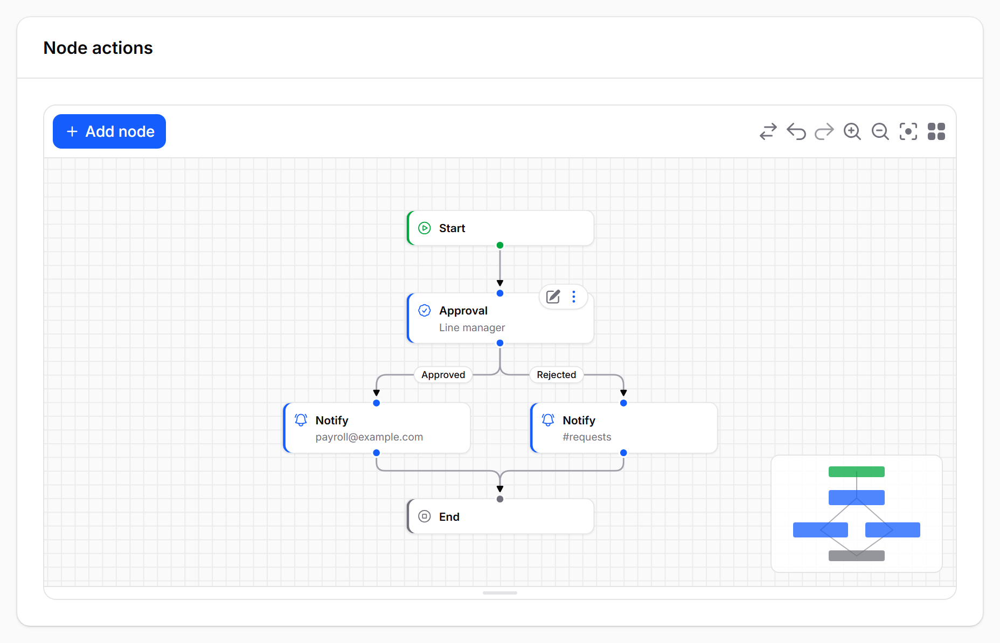</td>
<td width="50%">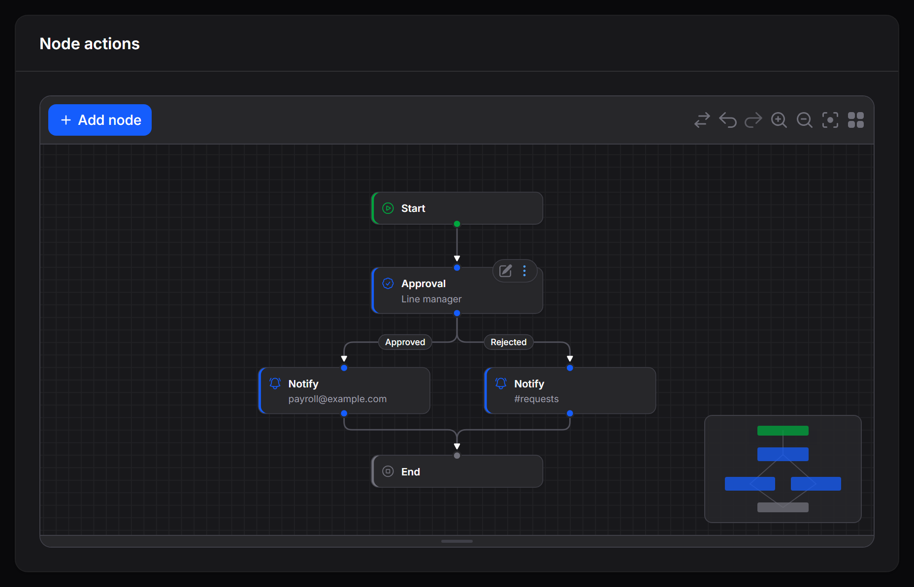</td>
</tr></table>

<table><tr>
<td width="50%">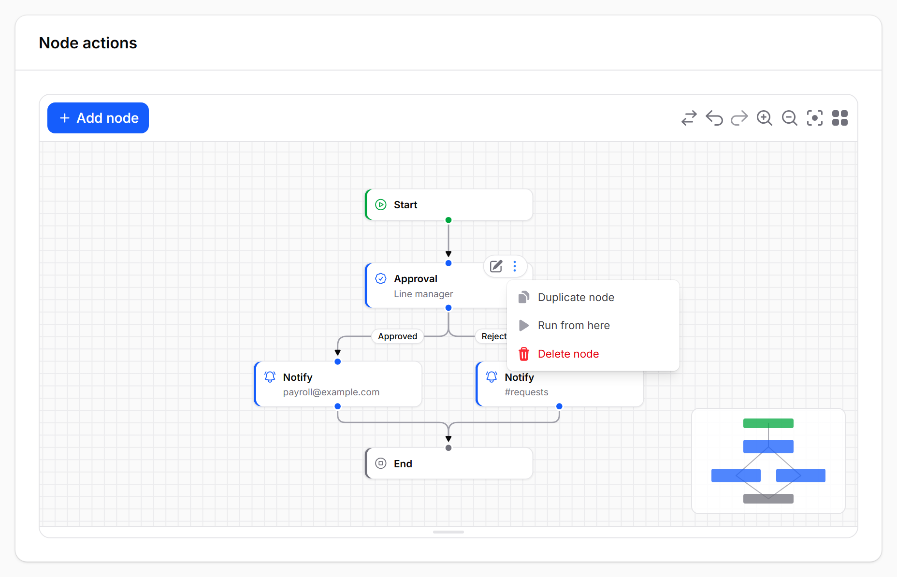</td>
<td width="50%">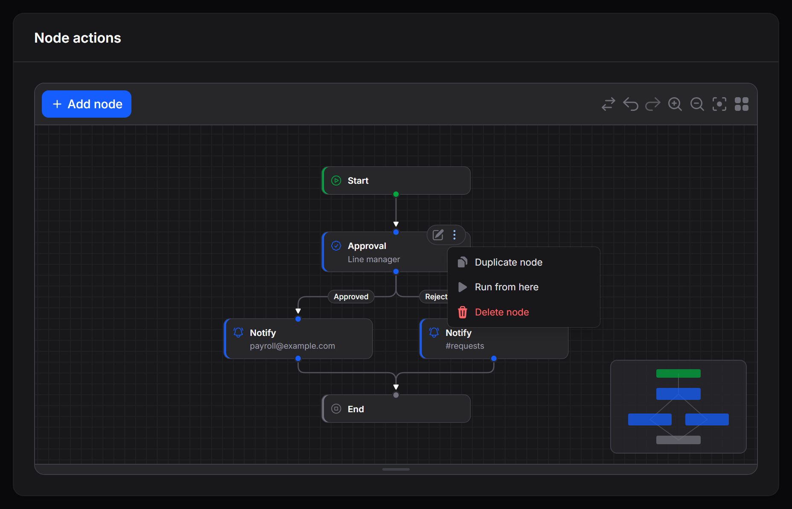</td>
</tr></table>

### Node context

Every action is mounted with `['nodeId' => …, 'nodeType' => …]`. On a plain Filament action, take `$arguments` and resolve the node through the canvas:

```php
Action::make('rename')
    ->action(function (array $arguments, CircuitCanvas $component): void {
        $node = $component->getNode($arguments['nodeId']);   // id, type, position, config, summary
    });
```

`Devletes\Circuit\Actions\NodeAction` skips the lookup: it injects `$node`, `$nodeId` and `$nodeType` into every closure — `label()`, `icon()`, `visible()`, `hidden()`, `action()`, and the rest:

```php
NodeAction::make('openTicket')
    ->icon('heroicon-m-ticket')
    ->visible(fn (?array $node): bool => filled($node['config']['ticket'] ?? null))
    ->url(fn (array $node): string => route('tickets.show', $node['config']['ticket']));
```

Visibility is evaluated **per node**, at render time, so an action hidden for one node type simply isn't rendered on those cards.

| Factory | What it does |
|---|---|
| `CircuitCanvas::configureNodeAction()` | Opens the built-in node-config modal — the same one a double-click mounts |
| `CircuitCanvas::deleteNodeAction()` | Removes the node and every edge touching it |

Both are `NodeAction`s, both run entirely on the client, and both are marked `mutatesGraph()`.

`CircuitEntry` accepts `nodeActions()` too — a "view details" modal, a link out to whatever a node points at. Actions declaring `mutatesGraph()` are **dropped rather than rendered**, since a read-only canvas has no commit path. Mark your own with `NodeAction::make(…)->mutatesGraph()` if it edits the graph.

## Connections

A node type can declare **outcomes** — the distinct ways it can conclude. An edge may bind to one; whatever executes the graph reads it to pick which edge to follow. An edge may also carry a **condition**: an opaque payload Circuit stores verbatim and never interprets.

```php
CircuitCanvas::make('graph')
    ->edgeSchema(fn (array $edge, array $source, array $target, array $condition): array => [
        Select::make('field')->options(['amount' => 'Amount', 'department' => 'Department']),
        Select::make('op')->options(['>' => 'is over', '<' => 'is under']),
        TextInput::make('value'),
    ])
    ->edgeLabel(fn (array $edge): ?string => match ($edge['condition']['op'] ?? null) {
        '>' => "{$edge['condition']['field']} over {$edge['condition']['value']}",
        default => null,
    })
```

Outcome labels come from the node type natively. Condition summaries come from `edgeLabel()` — the payload is opaque, so only your app can describe it. Without the hook (or when it returns null), a condition edge falls back to a generic *Conditional* pill.

<table><tr>
<td width="50%">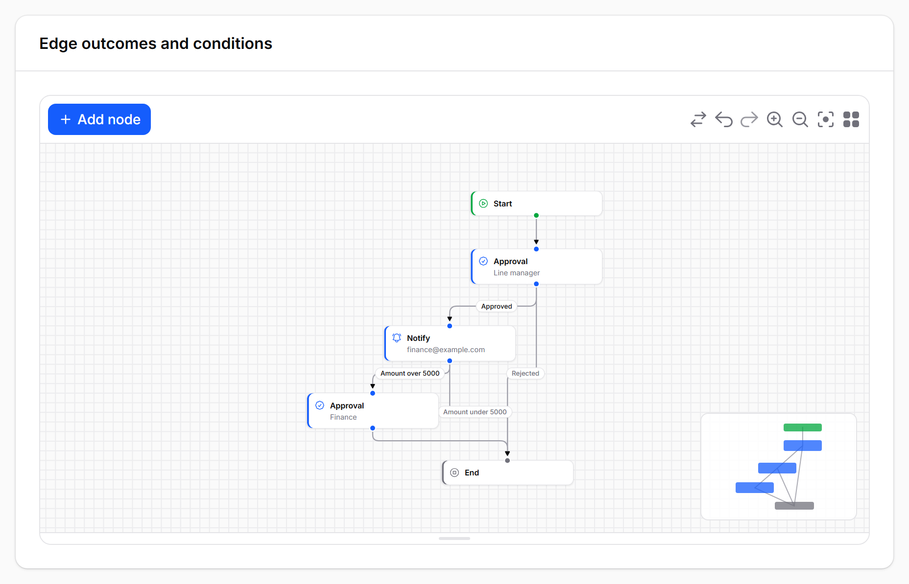</td>
<td width="50%">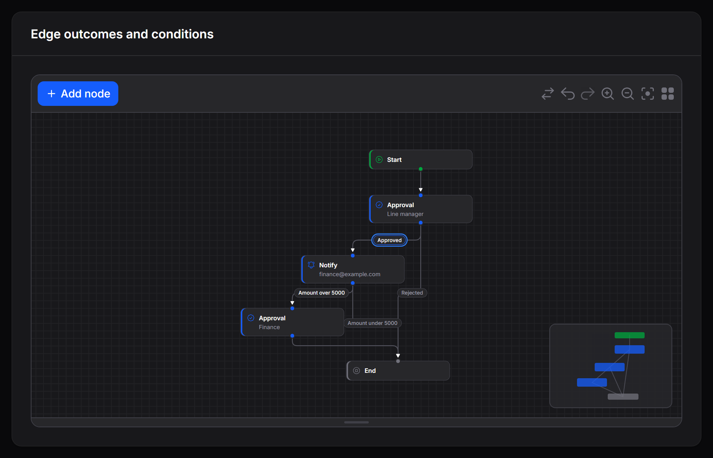</td>
</tr></table>

The `edgeSchema` closure also receives `$sourceType` / `$targetType` (`NodeType` instances); take whichever arguments you need, by name. Components are state-pathed under `condition` automatically, so the payload stays one opaque array on the edge.

### Configuring an edge

Every configurable connection carries a control at its **midpoint**. A connection with a label *is* that control (the pill is a real button); one with nothing to show yet gets a small round **+**. Double-clicking the edge, and the toolbar's *Configure connection* button while an edge is selected, do the same.

<table><tr>
<td width="50%">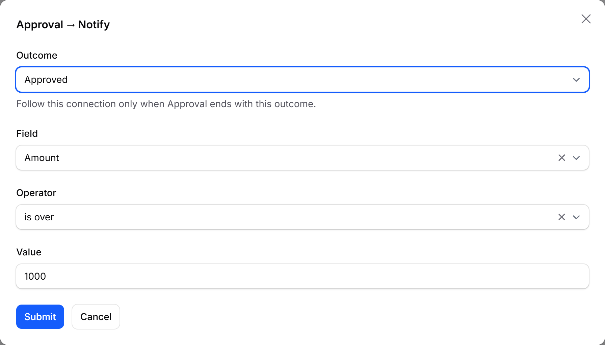</td>
<td width="50%">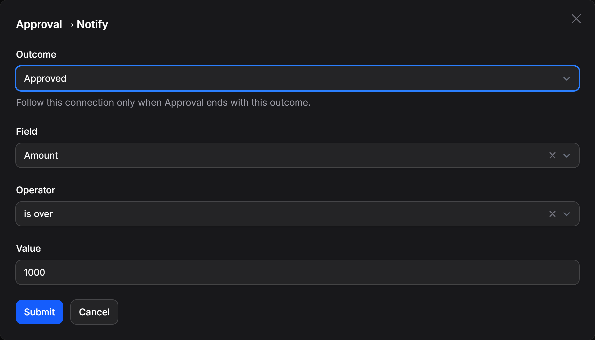</td>
</tr></table>

The control appears only when there is something to open: never on a `CircuitEntry`, and never on an edge whose source type declares no outcomes when no `edgeSchema` is set. Clicking one never starts a pan and never changes the selection, so a connection you meant to configure is not left armed for <kbd>Delete</kbd>.

Outside a Filament schema, the same fallback events exist as for nodes: `circuit-edge-edit` fires with `{ id, source, target, outcome, condition }`, and you write back with `$dispatch('circuit-update-edge', { id, outcome, condition, label })`.

## Validation

Topology is checked at save time and surfaced as a normal field validation error:

- exactly one node of each `initial()` type, at least one `terminal()`
- no cycles, no orphans, no dangling edges
- `maxOutgoing` / `maxIncoming` respected
- every non-terminal node has an outgoing connection
- an edge's `outcome` exists on its source node's type
- no two edges out of one node claim the same outcome

Problems are also attributed to the offending node: it outlines red, shows the message inline, sets `aria-invalid`, and the toolbar shows a problem-count badge. After each commit the canvas re-validates through a renderless round-trip, so highlights track the live graph.

<table><tr>
<td width="50%">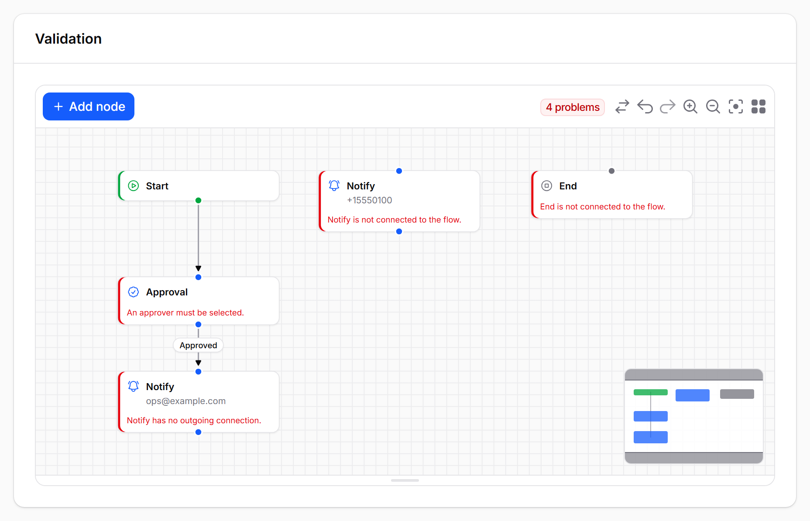</td>
<td width="50%">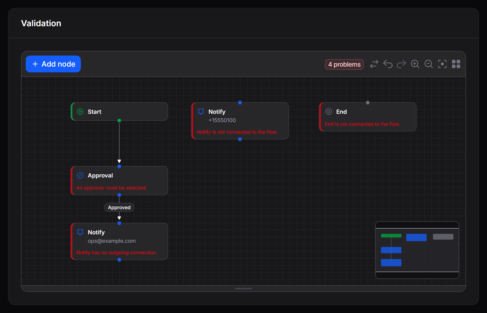</td>
</tr></table>

```php
CircuitCanvas::make('graph')
    ->validateTopology(false)     // free-form diagrams
    ->validateNodeConfig(false)   // skip the types' own validateConfig() rules
```

A field with a `default()` graph stays quiet until it is touched: a new record opens on a starting point that is incomplete by definition, and painting a form red before it has been used trains people to ignore the colour. Nothing is skipped at save time; the rule runs on whatever is submitted.

The canvas also refuses invalid connections *while dragging* — self-links, duplicates, edges into an `initial()` node, edges out of a `terminal()` one, and anything that would create a cycle. Valid drop targets highlight green.

<table><tr>
<td width="50%">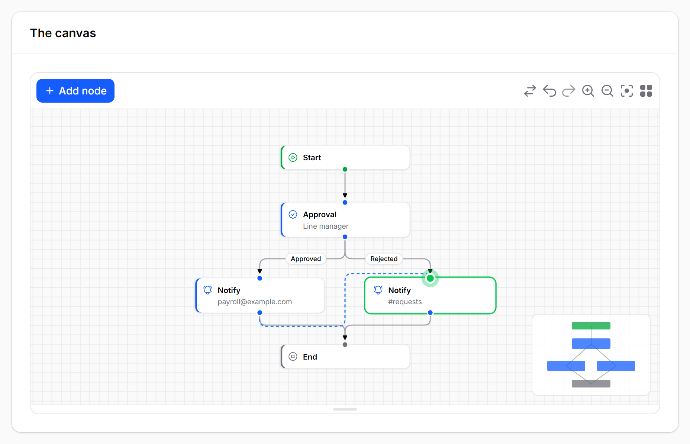</td>
<td width="50%">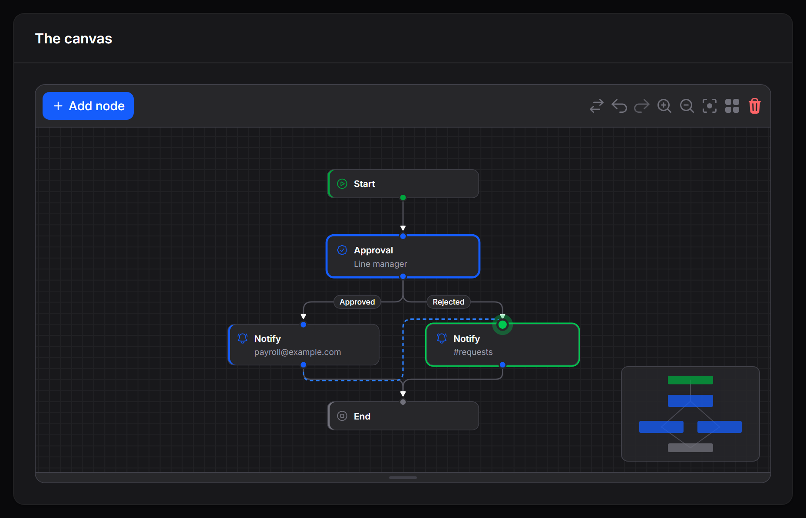</td>
</tr></table>

## Interaction

| Action | Input |
|---|---|
| Pan | Drag the background — stops once only a sliver of the graph is left on screen |
| Zoom | Scroll, or the toolbar buttons |
| Move node | Drag it (snaps to grid), or arrow keys (<kbd>Shift</kbd> for 4×) |
| Connect | Drag from a node's bottom handle onto another node |
| Select | Click, or <kbd>Tab</kbd> onto a node |
| Configure | Double-click, or <kbd>Enter</kbd> / <kbd>Space</kbd> |
| Configure edge | The control at the connection's midpoint — its label pill, or a **+** when it has no label |
| Delete | <kbd>Delete</kbd> / <kbd>Backspace</kbd>, or the toolbar |
| Undo / redo | <kbd>Ctrl</kbd>/<kbd>Cmd</kbd> + <kbd>Z</kbd>, <kbd>Shift</kbd> to redo (<kbd>Ctrl</kbd> + <kbd>Y</kbd> too), or the toolbar |
| Fit / tidy | Toolbar |
| Flip direction | Toolbar — swaps between top-down and left-to-right, and tidies up after itself |
| Resize | Drag the grip on the canvas's bottom edge, or focus it and use <kbd>↑</kbd>/<kbd>↓</kbd> |

Undo covers every graph edit — moving, adding, deleting, connecting, and config written through a node's modal — up to 50 steps. It deliberately does **not** restore the viewport: panning is not an edit. The shortcut stands down inside text fields and open modals.

Nodes are focusable with ARIA roles and labels; the surface announces node and connection counts.

Connections are drawn as straight runs with rounded corners, always leaving and entering along the flow axis. A connection that would be drawn straight over a card it is not attached to bows out to a clear lane instead, one step further out for each other skip already routed the same way.

## Options

Both `CircuitCanvas` and `CircuitEntry` take the same presentation and interaction options:

| Method | Effect |
|---|---|
| `height()` | The height the canvas opens at — a starting point, not a ceiling |
| `direction()` / `horizontal()` / `vertical()` | Which way the flow reads |
| `resizable()` | Grip on the bottom edge for dragging it taller |
| `orientable()` | Toolbar toggle between top-down and left-to-right — on read-only entries too |
| `undoable()` | Undo/redo — the buttons and the shortcuts |
| `historyLimit()` | How many states undo remembers |
| `tidyable()` | The tidy-up button that re-runs the automatic layout |
| `zoomable()` | Zoom in/out and fit-to-view, and wheel-to-zoom — on read-only entries too |
| `showMinimap()` | The minimap in the corner |
| `minimapSize()` | How big it is, in pixels — `minimapSize(240, 150)`, or one argument for a square |

`CircuitCanvas` adds `snapToGrid()` and `gridSize()` for drag behaviour.

```php
CircuitCanvas::make('graph')->horizontal()
```

<table><tr>
<td width="50%">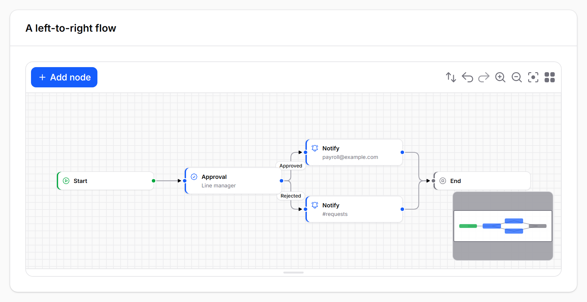</td>
<td width="50%">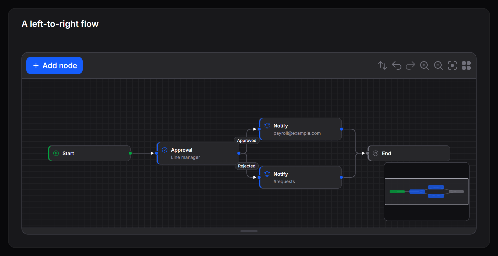</td>
</tr></table>

```php
CircuitCanvas::make('graph')->minimapSize(240, 150)
```

<table><tr>
<td width="50%">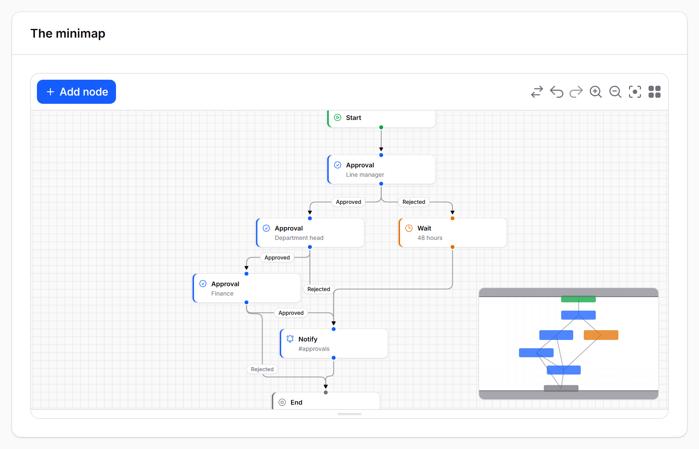</td>
<td width="50%">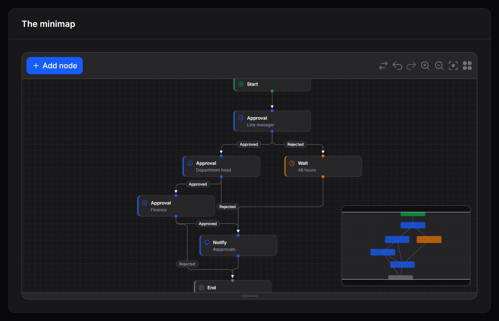</td>
</tr></table>

Turning a tool off hides its control **and** disables the behaviour behind it, so nothing stays reachable by shortcut that the interface no longer shows:

```php
CircuitCanvas::make('graph')
    ->orientable(false)
    ->undoable(false)
    ->tidyable(false)
    ->zoomable(false)
    ->resizable(false)
    ->showMinimap(false)
```

<table><tr>
<td width="50%">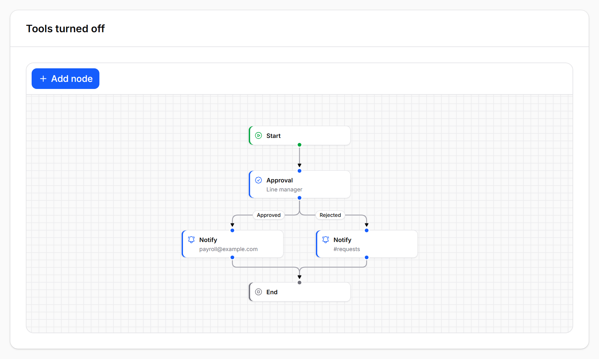</td>
<td width="50%">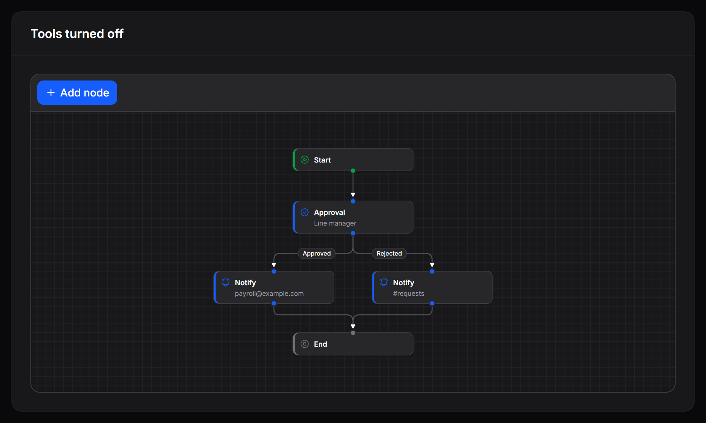</td>
</tr></table>

Every option accepts a bool or a `Closure`, so a tool can be gated per user:

```php
->tidyable(fn (): bool => auth()->user()->isAdmin())
```

### Defaults

Every option falls through to `config/circuit.php` when a field does not set it:

```bash
php artisan vendor:publish --tag=circuit-config
```

It carries the starting heights (separately for the canvas and the read-only entry), the resize bounds, the starting direction, the tools above, the undo depth, and the grid. Because options resolve at read time rather than at construction, changing the config moves every canvas that never said otherwise. Passing `null` to any option puts it back under the config's control.

Direction is **not** remembered across reloads, deliberately: it is only coherent alongside positions laid out for it, and those live in the saved graph. Height is remembered per field, client-side, because it changes nothing about the graph.

## Read-only entries

`CircuitEntry` renders a saved graph on infolists and View pages — same canvas, same styling, no editing affordances. Filament v4's unified schemas also allow it inside a form schema.

It does keep the tools that change how the graph is *looked at* rather than what it says: **zoom in**, **zoom out**, **fit to view**, and the **orientation flip** whose re-layout never leaves the browser. `zoomable(false)` and `orientable(false)` drop them; with both off the entry has no toolbar at all.

An entry also **fits to view every time it opens**, ignoring any viewport saved with the graph — that viewport is whoever last edited it panning around a box of a different size. The fit stays armed until it lands, so a preview born inside a modal, a collapsed section or an inactive tab still centres itself the moment it has room to. Once the viewer pans or zooms, nothing re-fits underneath them.

```php
use Devletes\Circuit\Infolists\Components\CircuitEntry;

CircuitEntry::make('graph')
    ->nodeTypes(app(NodeRegistry::class))
    ->height(460);
```

<table><tr>
<td width="50%">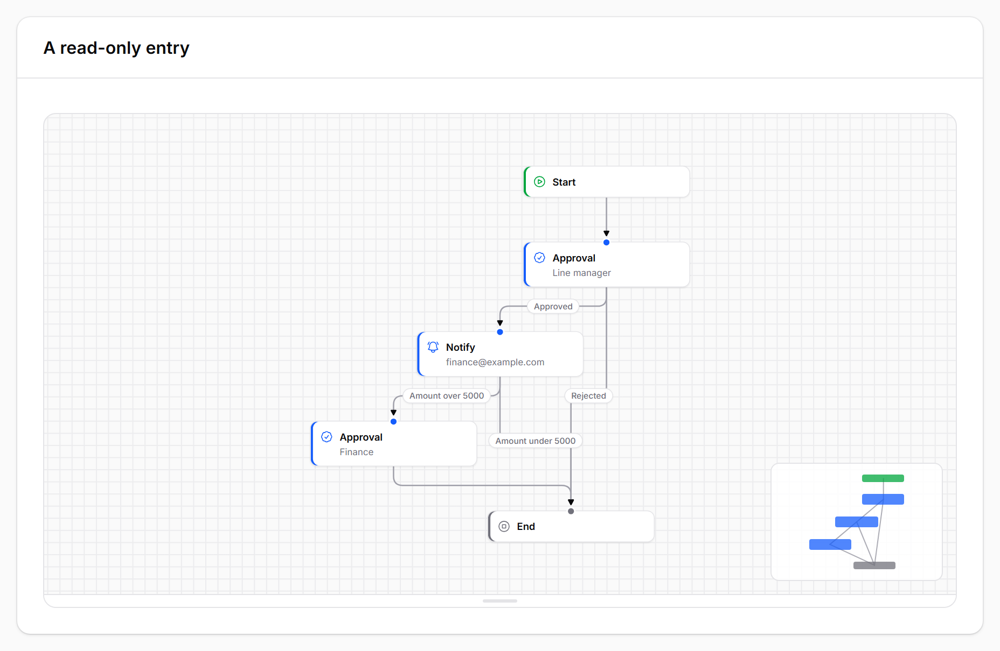</td>
<td width="50%">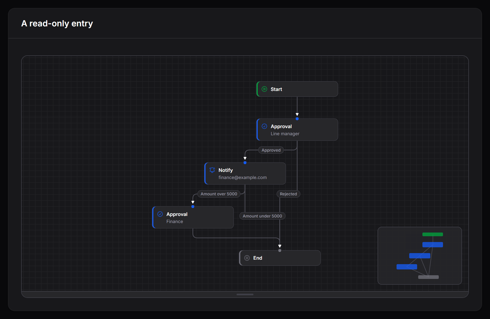</td>
</tr></table>

## The saved contract

```jsonc
{
  "nodes": [
    { "id": "n1", "type": "approval", "position": { "x": 0, "y": 140 }, "config": { }, "summary": "Line manager" }
  ],
  "edges": [
    { "id": "e1", "source": "n1", "target": "n2", "outcome": "approved", "condition": null }
  ],
  "viewport": { "x": 0, "y": 0, "zoom": 1 }
}
```

`config` is opaque to Circuit — it is whatever that node type's `schema()` produces. On an edge, both `outcome` and `condition` are optional, and a bare edge means "always follow". Edges with a condition also carry a derived `label`, recomputed on every hydration.

A graph whose nodes all carry `"position": null` asks the canvas to lay itself out on first paint — the same tidy-up the toolbar runs, which is a convenient way to seed a default.

Read it server-side with the `Graph` value object:

```php
use Devletes\Circuit\Support\Graph;

$graph = Graph::fromArray($workflow->graph);

$graph->nodesOfType('approval');   // array of nodes
$graph->successors('n1');          // ['n2']
$graph->reachableFrom(['start']);  // every connected node id
$graph->hasCycle();                // bool
$graph->problems($types);          // the same messages the canvas shows
```

### Runtime scaffolding

Circuit never executes a graph, but it ships the vocabulary for engines that do, so a node's behaviour can live on its definition:

```php
use Devletes\Circuit\Contracts\ExecutesNode;
use Devletes\Circuit\Contracts\ResumesNode;
use Devletes\Circuit\Support\NodeResult;

class WaitNode extends NodeDefinition implements ExecutesNode, ResumesNode
{
    public function execute(array $node, mixed $context = null): NodeResult
    {
        return NodeResult::waiting('timer:'.$node['id']);
    }

    public function resume(array $node, mixed $context = null, array $payload = []): NodeResult
    {
        return NodeResult::completed($payload);
    }
}
```

`completed()` lets the walk continue; `waiting($reference)` suspends the run on something external, with `reference` identifying it so the completion signal routes back. `NodeResult` round-trips through `toArray()`/`fromArray()` for engines persisting suspended state. The engine itself — persistence, walking, resumption — belongs to the application. Circuit only fixes the contract.

## Theming

Everything resolves through CSS custom properties on `.fi-circuit`, and Filament's palette variables are the defaults:

```css
.fi-circuit {
    --fi-circuit-surface: var(--gray-50);
    --fi-circuit-border: var(--gray-200);
    --fi-circuit-grid: var(--gray-200);
    --fi-circuit-node-bg: #fff;
    --fi-circuit-text: var(--gray-950);
    --fi-circuit-muted: var(--gray-500);
    --fi-circuit-edge: var(--gray-400);
    --fi-circuit-accent: var(--primary-600);
}
```

Override any of them in your panel theme. Dark mode is handled under `:where(.dark) .fi-circuit`, and a node's `color()` swaps `--fi-circuit-accent` per card.

<table><tr>
<td width="50%">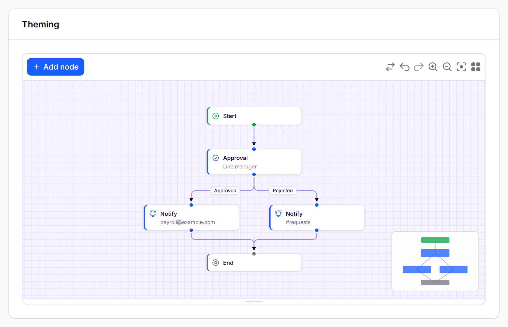</td>
<td width="50%">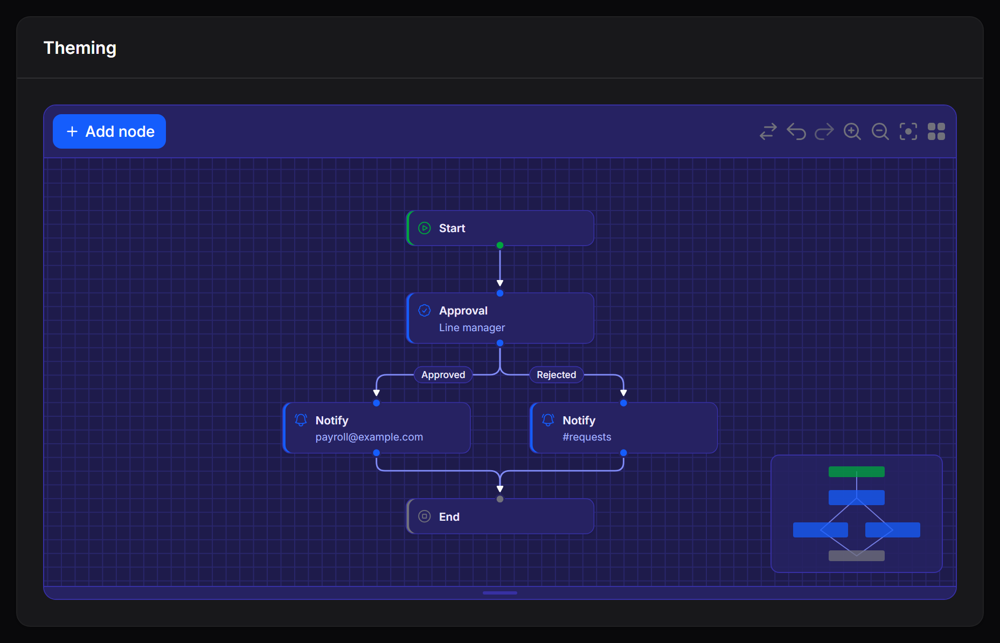</td>
</tr></table>

## Livewire behaviour

State is written to `$wire` only at commit points — drag end, connect, delete, config change. Never during a pointer move. The canvas carries `wire:ignore`.

Every commit stages the graph immediately (no request), so a save that lands mid-edit always carries the latest state. Viewport-only commits — pan, zoom, fit — stop there: zero requests, the viewport rides along with the next real one.

Graph edits schedule **one** debounced (400ms), serialized round-trip that returns the three things only the server can produce: validation problems, the per-node action bars, and the node infolist bodies. That trip is skipped when nothing it computes could have changed — so moving a node, tidying up and flipping direction cost nothing, while adding, deleting or reconfiguring one costs a single request. A `live()` field is the exception, and asks for a trip either way.

One request is in flight at a time; edits made during a flight are re-sent when it completes, and a slow response never overwrites a newer one. The graph is deep-cloned at every Livewire boundary. A canvas born hidden (collapsed section, inactive tab) auto-fits the first time it gains size — unless a saved viewport exists, which is never overridden.

## Integration examples

A `CircuitCanvas` in a resource's Edit page:

<table><tr>
<td width="50%">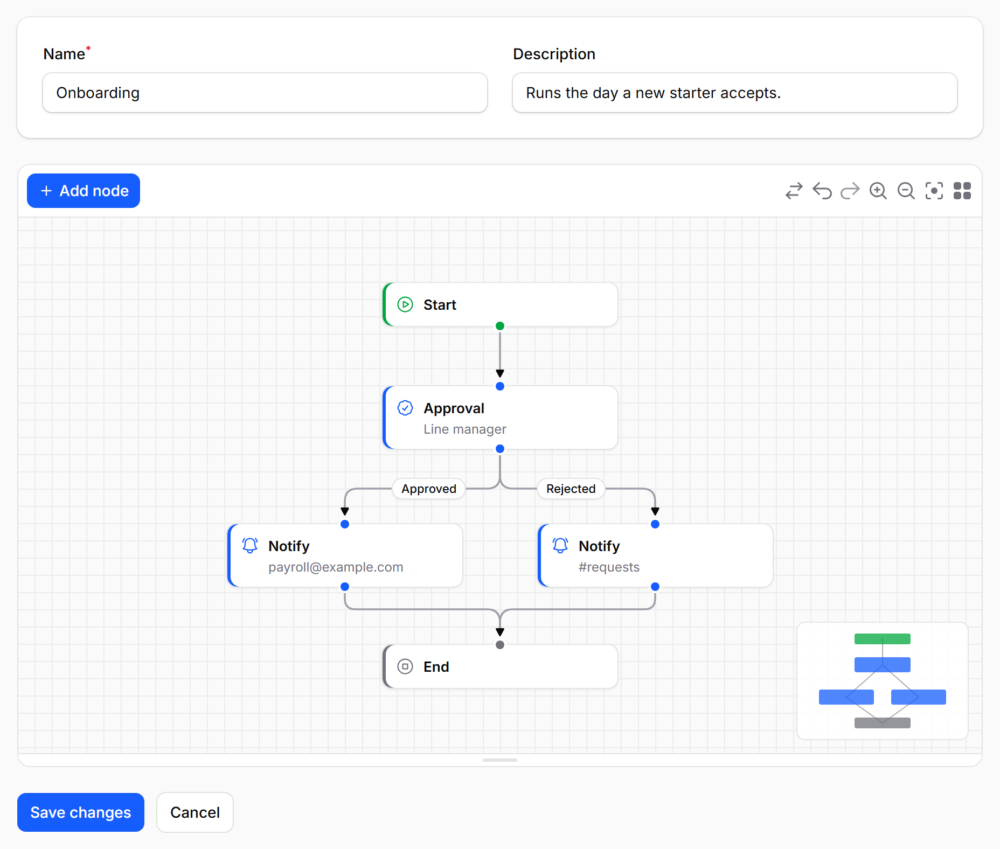</td>
<td width="50%">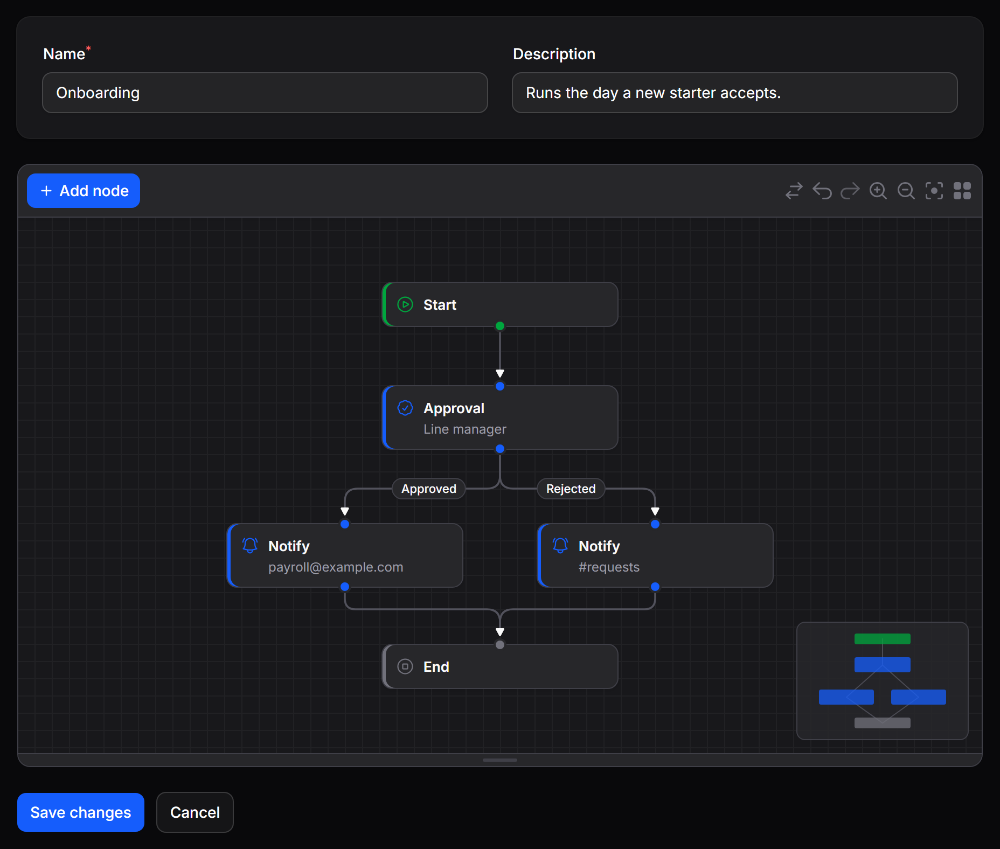</td>
</tr></table>

A `CircuitEntry` on the matching View page:

<table><tr>
<td width="50%">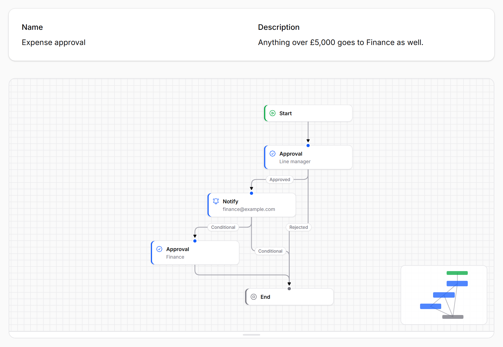</td>
<td width="50%">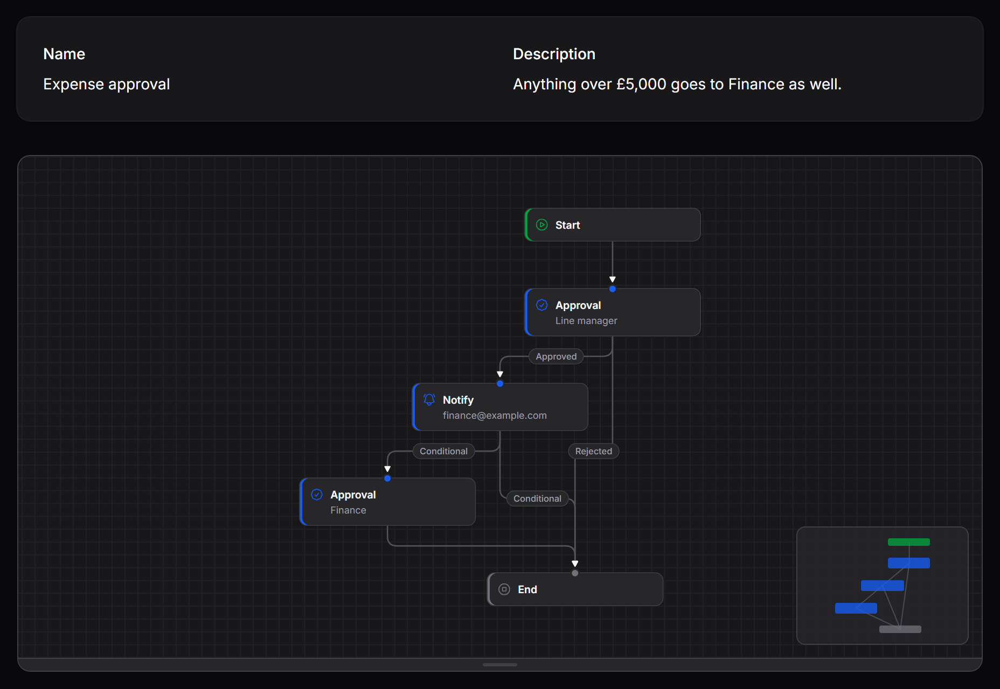</td>
</tr></table>

## Testing

```bash
composer install
composer test
```

The suite runs on Testbench with the real Filament stack, so the canvas is exercised as what it is — a schema component inside a Livewire form. `tests/Unit` covers the graph and node-type layer with no framework in the way; `tests/Feature` drives `CircuitCanvas` and `CircuitEntry` through a Livewire component, including the mounted config actions and save-time validation.

One ordering detail matters if you build your own harness: Filament rebinds Livewire's `DataStore` to a subclass with a plain `bind()`, so **Livewire's service provider has to be registered after Filament's**. Registered first, its `instance()` binding is replaced and nothing Livewire writes to the store survives the request. `tests/TestCase.php` has the working order.

### Workbench and screenshots

```bash
composer serve                          # http://127.0.0.1:8765, admin: aria@example.com / password
node scripts/capture-screenshots.mjs    # regenerates docs/images/*.png
```

The workbench panel carries a `/admin/showcase` page with one `data-demo` section per README heading, plus a Workflow resource for the integration shots. The capture script clips each section in both colour modes.

## Scope

Circuit is deliberately **not** an API-compatible React Flow port. It covers what a configuration canvas needs — a few dozen nodes, authored by an admin, saved to a column.

Not implemented, by choice: viewport virtualisation for very large graphs, multi-select and marquee selection, collaborative editing, nested / grouped nodes, and freely positioned handles (source is bottom-centre, target is top-centre).

## Need something custom?

We build production Filament panels and plugins for teams that want to ship fast without compromising on polish. If you need a custom feature, an extended variant of this package, or a fully bespoke component built for your stack, we can help.

- **Browse the rest of our Filament work:** [filament.devletes.com](https://filament.devletes.com)
- **Get in touch:** [salman@devletes.com](mailto:salman@devletes.com)

Typical engagements: new Filament plugins, custom resources/widgets/actions, theme + UX work, integrations with your existing services, and one-off tailored forks of our open-source packages.

## Have you seen our Orbit theme?

Orbit is our dark-first theme for Filament 5. Every panel surface is restyled — sidebar, topbar, forms, tables, modals, notifications.

<table><tr>
<td width="50%"></td>
<td width="50%"></td>
</tr></table>

**[Check it out here](https://filament.devletes.com/orbit) →**

## Credits

- [Salman Hijazi](https://www.linkedin.com/in/syedsalmanhijazi/)

## License

MIT. See [LICENSE.md](LICENSE.md).
